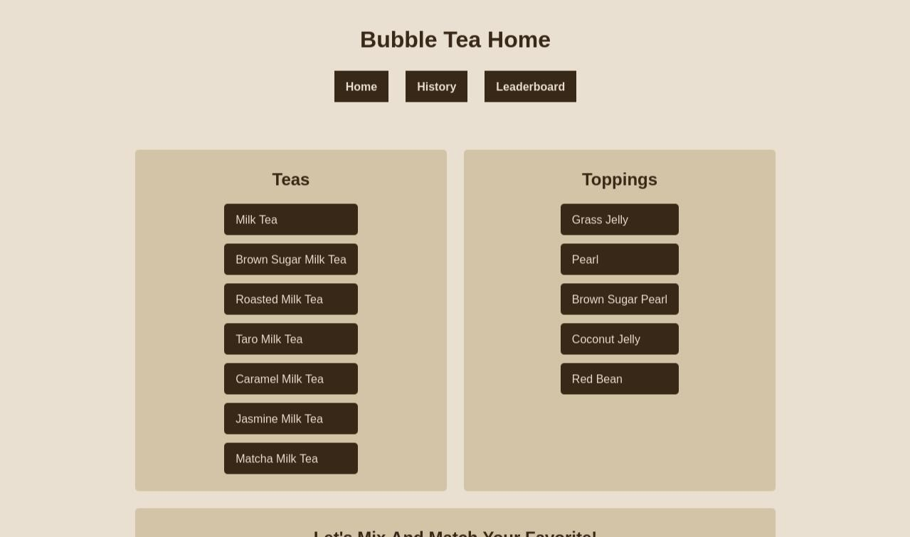

# Bubble Tea App



This is an app where users can learn about the short history of bubble tea, and submit their favorite combinations. And a leaderboard shows which flavors are loved by the users.

The user should be able to do:

- [x] Can `drag and drop` one of the teas and one of the toppings
- [x] Can `click` one of the teas and one of the toppings
- [x] Submit drink combination to the database
- [x] Clear the drink choice
- [x] View the history of bubble tea
- [x] see the leaderboard of popular drink combinations

[View the site live here](https://bubble-tea.cyclic.app/)

## Tech stack:


## Screenshots/gif

<details>
<summary>Overview</summary>


</details>

<hr />

<details>
<summary>The correct way!</summary>


</details>

<hr />

<details>
<summary>The incorrect way</summary>


</details>

<hr />

## Installation

Before installing, make sure you have node.js installed on your machine. If it is already installed, follow the steps below.

Step 1

```
git clone git@github.com:victoriacheng15/bubble-tea-api.git
```

Step 2

```
cd bubble-tea-api
```

Step 3

```
npm install
```

Step 4

Please refer to this [guide](https://www.mongodb.com/basics/mongodb-atlas-tutorial) on how to set up the MongoDB atlas.

Step 5

```
npm run dev
```

## What I learned

This project helped me to understand how to interact with the frontend with the backend server. Users can submit their information to the database, in this case, the information will be their favorite type of tea and topping. The page needs to ensure the information is correct before sending it to the server. Once the information is submitted, the server will either create or update the data.

I also learned about drag-and-drop API. One thing I didn't realize is that the drag{somrthing} (e.g. dragenter, dragstart, etc) is click type, which means it would not work on mobile devices. For drag-and-drop API to work on mobile devices, it needs to use touch{something} (e.g. touchstart, touchmove, etc) event listeners for the users to use this app on mobile devices.

## Author

[](https://www.linkedin.com/in/victoriacheng15/) [](https://twitter.com/viktoriacheng15)
